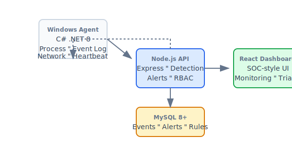

<p align="center">
  
</p>

<p align="center">
  
  
  
  
  
</p>

<p align="center">
  <strong>IronShield EDR</strong> — A defensive Windows Endpoint Detection and Response (EDR) platform<br>
  for endpoint monitoring, security event analysis, and coordinated response.
</p>

<p align="center">
  Built as an enterprise-ready foundation (hardened defaults, multi-tenant, RBAC, audit integrity).
</p>

<p align="center">
  <a href="#latest-updates">Latest updates</a> •
  <a href="#screenshots">Screenshots</a> •
  <a href="#-features">Features</a> •
  <a href="#-quick-start">Quick Start</a> •
  <a href="#-architecture">Architecture</a> •
  <a href="#-api-overview">API</a> •
  <a href="docs/">Documentation</a> •
  <a href="docs/falcon-parity-features.md">Falcon-class feature map</a> •
  <a href="docs/crowdstrike-ui-phase1.md">Falcon-style UI (Phase 1)</a> •
  <a href="docs/crowdstrike-ui-phase4.md">Sensor telemetry (Phase 4)</a> •
  <a href="docs/crowdstrike-ui-phase5.md">Tenants (Phase 5)</a> •
  <a href="docs/crowdstrike-ui-phase6.md">Sensor updates (Phase 6)</a> •
  <a href="docs/crowdstrike-ui-phase7.md">NGAV / Malware prevention (Phase 7)</a> •
  <a href="docs/crowdstrike-ui-phase8.md">EDR sensor policy (Phase 8)</a> •
  <a href="docs/crowdstrike-ui-phase9.md">Policy compliance (Phase 9)</a> •
  <a href="docs/crowdstrike-ui-phase10.md">Host timeline (Phase 10)</a> •
  <a href="docs/falcon-advanced-ui.md">Falcon-class advanced UI (RTR, graph, analytics)</a> •
  <a href="docs/crowdstrike-detection-rules.md">Detection rules (Custom IOA)</a> •
  <a href="docs/detection-upgrade-plan.md">Detection upgrade plan</a> •
  <a href="docs/crowdstrike-network-activity.md">Network activity (Falcon-style)</a> •
  <a href="docs/enterprise-hardening.md">Enterprise hardening</a> •
  <a href="docs/security/README.md">Security assurance (threat model, controls)</a>
</p>

---

## 🆕 Latest updates

| When | What |
|:-----|:-----|
| **Mar 2025** | **Network activity (Falcon-style)** — Explore page: KPI strip backed by `GET /api/admin/network/summary`, time window + endpoint filters, **Exclude localhost**, remote IP / process search, **Scope** badges (RFC1918 / External / Loopback), tabs (Connections, Outgoing IPs, Traffic by endpoint, Network logs). Docs: [crowdstrike-network-activity.md](docs/crowdstrike-network-activity.md). |
| **Mar 2026** | **XDR UI + integrations** — Added XDR pages for `xdr_events` and `xdr_detections`, live **Realtime** feed (`/ws`), host/network bandwidth (RX/TX Mbps), and Enterprise settings for **3rd‑party IP blacklist feeds** → IOC watchlist (`/api/admin/xdr/ip-feeds`). |
| **Mar 2025** | **README** — Screenshot gallery (vector UI previews) + this changelog. Rebuild dashboard after UI changes: `cd server-node && npm run build-dashboard`. |
| **Earlier** | Falcon parity phases (sensor telemetry, tenants, NGAV, EDR policy, policy compliance, host timeline), **Detection rules** (Custom IOA), **RTR**, **Threat graph**, **Hunting**, **IOC** watchlist — see [falcon-parity-features.md](docs/falcon-parity-features.md). |

---

## 📋 Overview

IronShield EDR is a full-stack security platform that combines telemetry collection, rule-based detection, real-time response actions, and a SOC-style dashboard. Deploy agents on Windows endpoints, ingest events, and analyze threats with built-in antivirus correlation and investigation workflows.

| Component | Tech Stack | Description |
|:----------|:-----------|:------------|
| **Windows Agent** | C# .NET 8 | Collects process events, Windows Event Log, network telemetry; sends to backend |
| **Backend API** | Node.js + Express | Event ingestion, detection engine, alerts, RBAC |
| **Database** | MySQL 8+ | Endpoints, events, alerts, rules, investigations |
| **Admin Dashboard** | React | SOC-style UI for monitoring, response, and triage |

---

## 📸 Screenshots

<p align="center">
  <sub>Architecture diagram: <a href="#-architecture">Architecture</a> · Banner: <code>assets/banner.svg</code></sub>
</p>

The repo no longer ships “demo preview” screenshots by default. Generate your own UI captures for releases.

---

## ✨ Features

### Core Capabilities

- **Endpoint Monitoring** — Process events, Windows Event Log, network connections, file hashing
- **Detection Engine** — JSON/Sigma-style rules with MITRE ATT&CK mapping
- **Response Actions** — Kill process, triage collection, host isolation (policy)
- **Real Time Response (RTR)** — Remote shell sessions + command queueing, with allowlists and audit trail
- **MSSP Operations** — Per-client overview (endpoints, alerts, investigations) for internal SOC workflows
- **Alert Management** — Severity, status, notes, investigation linking
- **Incident Correlation** — Group related alerts into incidents
- **Risk Scoring** — Endpoint risk based on alert severity and count
- **IOC Watchlist** — Hash, IP, domain, URL indicators (matched during ingestion)
- **Threat intel integrations** — Add **3rd‑party IP blacklist feeds** from Enterprise settings → imports into IOC watchlist
- **Antivirus Module** — File scanning, signatures, heuristics, quarantine
- **XDR foundation** — Canonical multi-source event store (`xdr_events`), detections (`xdr_detections`), live `/ws` stream

### Dashboard Highlights

- **Network activity** — Falcon-style Explore view: KPIs, filters, scope badges, logs ([docs](docs/crowdstrike-network-activity.md); [screenshots](#screenshots))
- **Bandwidth telemetry** — Agent-reported RX/TX Mbps in host metrics and Network Explore when filtering by endpoint
- **Process Monitor** — Suspect process detection with suspicious path indicators
- **Process Tree** — Visualize process hierarchy from normalized events
- **Investigations** — Case management with notes and endpoint linking
- **Global Search** — Search across endpoints, alerts, events, hashes
- **AV Dashboard** — Detections, quarantine, policies, signatures, file reputation
- **XDR pages** — XDR events, XDR detections, and a Realtime console (WebSocket)

---

## 🚀 Quick Start

### 1. Database

```bash
# Using Docker
docker run -d --name edr-mysql \
  -e MYSQL_ROOT_PASSWORD=root \
  -e MYSQL_DATABASE=edr_platform \
  -e MYSQL_USER=edr_user \
  -e MYSQL_PASSWORD=edr_password \
  -p 3306:3306 \
  mysql:8.0

# Apply schema
mysql -h 127.0.0.1 -u edr_user -p edr_platform < database/schema.sql
mysql -h 127.0.0.1 -u edr_user -p edr_platform < database/schema-phase3.sql
mysql -h 127.0.0.1 -u edr_user -p edr_platform < database/schema-phase4.sql
mysql -h 127.0.0.1 -u edr_user -p edr_platform < database/schema-phase5.sql
mysql -h 127.0.0.1 -u edr_user -p edr_platform < database/schema-phase6.sql
mysql -h 127.0.0.1 -u edr_user -p edr_platform < database/schema-endpoint-metrics.sql
# Sensor telemetry columns (queue, uptime, containment) — or: cd server-node && npm run migrate-sensor-telemetry
# mysql ... < database/migrate-sensor-telemetry.sql   # prefer npm run migrate-sensor-telemetry (idempotent)

# Phase 5: tenants + endpoints.tenant_id (Falcon-style CID enrollment) — or:
# cd server-node && npm run migrate-phase5-endpoints-tenant
# Sensor update telemetry (pending update on host rows) — or:
# cd server-node && npm run migrate-phase6-agent-update-telemetry
mysql -h 127.0.0.1 -u edr_user -p edr_platform < database/schema-network.sql
mysql -h 127.0.0.1 -u edr_user -p edr_platform < database/schema-antivirus.sql
# NGAV telemetry columns on av_update_status (realtime, prevention, signature_count; after antivirus schema):
# cd server-node && npm run migrate-phase7-ngav-telemetry
# EDR policy id + last sync on endpoints:
# cd server-node && npm run migrate-phase8-edr-policy-sync
# RTR sessions + Falcon UI pack tables:
# cd server-node && npm run migrate-falcon-ui-pack

# Parity phases (DNS/registry/image fields, alert SLA/assignment, response actions, saved views).
# Requires phase5 tenants table if you use tenant_api_limits FK.
# mysql -h 127.0.0.1 -u edr_user -p edr_platform < database/migrate-parity-phases.sql

# Falcon-class host groups (sensor grouping) — or: cd server-node && npm run migrate-cs-parity
# mysql ... < database/migrate-cs-parity.sql   # see script; prefer npm run migrate-cs-parity

# Upgrades from older DBs: rename response action simulate_isolation → isolate_host
# mysql -h 127.0.0.1 -u edr_user -p edr_platform < database/migrate-isolate-host.sql
# Add lift_isolation action type (after isolate_host migration if needed)
# mysql -h 127.0.0.1 -u edr_user -p edr_platform < database/migrate-lift-isolation.sql

# Suppressions, response playbooks (capabilities v2) — from server-node:
# cd server-node && npm run migrate-capabilities-v2
```

Or use **Docker Compose**:

```bash
docker-compose up -d mysql
# Wait for MySQL to be ready, then schema is auto-applied
```

### 2. Backend

```bash
cd server-node
cp .env.example .env
# Edit .env: DB_*, JWT_SECRET, XDR_INGEST_KEY, CORS_ORIGINS
# AGENT_REGISTRATION_TOKEN is break-glass only; prefer per-tenant enrollment tokens.

npm install
ADMIN_PASSWORD="use-a-long-unique-password-here" npm run create-admin
npm start
```

Optional backend environment (see `server-node` / deployment):

| Variable | Purpose |
|----------|---------|
| `CORRELATION_INTERVAL_MS` | How often to run alert correlation (default `300000` = 5 min). |
| `ENABLE_TENANT_RATE_LIMIT` | Set `true` to cap requests per tenant. |
| `TENANT_RPM` | Requests per minute per tenant when rate limit is enabled (default `600`). |

Backend runs on **http://localhost:3001** (terminate TLS at a reverse proxy for enterprise use)

### 3. Dashboard

```bash
cd server-node/dashboard
npm install
npm test        # optional — Vitest (UI helpers + pagination)
npm run dev
```

Dashboard runs on **http://localhost:5173** (proxies `/api` to the backend — **use this for UI development**; edits hot-reload).

**If you open the UI through the backend only** (`http://localhost:3001`), the server serves the **pre-built** files in `server-node/public/`. After changing dashboard code, rebuild or you will **not** see updates:

```bash
cd server-node && npm run build-dashboard
# or: cd server-node/dashboard && npm run build
```

Then hard-refresh the browser (**Ctrl+Shift+R**) to bypass cache.

### 4. Windows Agent

**Option A: Installer (recommended)**

```powershell
# Run as Administrator
cd agent-csharp
.\Install-Agent.ps1 -ServerUrl "https://edr.example.com" -RegistrationToken "your-token-from-.env"
```

Or use the batch wrapper:

```cmd
install-agent.cmd https://edr.example.com your-registration-token
```

**Option B: Manual run**

```bash
cd agent-csharp
dotnet build
dotnet run --project src/EDR.Agent.Service -- --console
```

If `dotnet build` fails with **file locked** / `EDR.Agent.Core.dll` in use, stop the running agent (`EDR.Agent.Service`) or Windows service, then rebuild.

Create `config.json` in the agent directory (or copy `config.example.json` and fill in values):

```json
{
  "ServerUrl": "https://edr.example.com",
  "RegistrationToken": "your-token-from-.env",
  "HeartbeatIntervalMinutes": 5,
  "EventBatchIntervalSeconds": 30,
  "ScriptAllowlistPrefixes": ["C:\\IronShield\\Scripts\\"],
  "ScriptAllowlistSha256": []
}
```

`ScriptAllowlistSha256` is optional: when non-empty, `run_script` only executes if the file’s SHA-256 (hex) matches an entry (in addition to path prefix checks). See `docs/agent-service-hardening.md`.

**Legacy service install:**

```powershell
# Run as Administrator
.\install-service.ps1
Start-Service EDR.Agent
```

**Uninstall:**

```powershell
.\Install-Agent.ps1 -Uninstall
```

---

## 🏗 Architecture

<p align="center">
  
</p>

```
┌─────────────────┐     HTTPS      ┌─────────────────┐
│  Windows Agent  │ ──────────────►│  Node.js API   │
│  (C# Service)   │                │  (Express)     │
└─────────────────┘                └────────┬──────┘
        │                                   │
        │ Telemetry                         ▼
        │ - Process events             ┌──────────┐
        │ - Windows Event Log          │  MySQL   │
        │ - Heartbeats                 └──────────┘
        │                                   │
        │ Commands (Phase 2)                 ▼
        │ - Kill process              ┌──────────┐
        │ - Collect triage             │ Dashboard│
        └─────────────────────────────│  (React) │
                                      └──────────┘
```

**Roadmap & Falcon-style parity:** See [docs/crowdstrike-parity-roadmap.md](docs/crowdstrike-parity-roadmap.md) for a detailed capability analysis and prioritized upgrades (detection, response, RTR-style gaps, MSSP).

---

## 📡 API Overview

### Agent API

| Method | Endpoint | Auth | Description |
|:-------|:---------|:-----|:------------|
| POST | `/api/agent/register` | Registration token | Register new endpoint |
| POST | `/api/agent/heartbeat` | Agent key | Send heartbeat |
| POST | `/api/agent/events/batch` | Agent key | Upload event batch (supports `batch_id` idempotency) |
| POST | `/api/agent/key/rotate` | Agent key | Rotate agent key |
| GET | `/api/agent/actions/pending` | Agent key | Get pending response actions |
| POST | `/api/agent/actions/:id/result` | Agent key | Submit action result |
| GET | `/api/agent/av/policy` | Agent key | Get AV scan policy |
| GET | `/api/agent/av/signatures/download` | Agent key | Download signatures |
| POST | `/api/agent/av/scan-result` | Agent key | Submit scan results |

### Admin API (JWT)

| Method | Endpoint | Description |
|:-------|:---------|:------------|
| POST | `/api/auth/login` | Admin login |
| GET | `/api/admin/dashboard/summary` | Dashboard stats |
| GET | `/api/admin/endpoints` | List endpoints |
| GET | `/api/admin/alerts` | List alerts |
| POST | `/api/admin/endpoints/:id/actions` | Create response action |
| POST | `/api/admin/endpoints/:id/agent-key/revoke` | Revoke endpoint agent key |
| POST | `/api/admin/endpoints/:id/agent-key/rotate` | Rotate endpoint agent key |
| GET | `/api/admin/process-monitor` | Process monitor data |
| GET | `/api/admin/network/summary` | Network KPIs (connections, unique IPs, hosts, destinations) |
| GET | `/api/admin/network/connections` | Network connections (filters: `hours`, `remoteAddress`, `processName`, …) |
| GET | `/api/admin/av/detections` | AV detections |
| POST | `/api/admin/av/scan-task` | Create scan task |

See [docs/api.md](docs/api.md) for full API reference.

---

## 🛡 Antivirus Module

- **File scanning** — On-demand, scheduled, real-time (FileSystemWatcher)
- **Detection** — Signature (hash, path, binary pattern), heuristics, PE metadata
- **Quarantine** — Move to protected folder, restore/delete workflow
- **Correlation** — Malware alerts → EDR alerts, risk scoring

See [docs/antivirus-setup.md](docs/antivirus-setup.md) and [docs/antivirus-architecture.md](docs/antivirus-architecture.md).

---

## ⚠️ Security Notes

- Provide a strong `JWT_SECRET` and store it in a secrets manager
- Prefer per-tenant enrollment tokens; keep `AGENT_REGISTRATION_TOKEN` for break-glass only
- Deploy behind HTTPS (reverse proxy or TLS-terminated service)
- Agent runs as LocalSystem by default; consider dedicated service account
- Response actions (e.g. kill process) require trusted server and secure channel

---

## 📄 License

MIT License

---

## 👤 Developer

**Coder-X**

[](https://github.com/Coder-MoeTain)

---

<p align="center">
  <sub>Built with ❤️ for the security community</sub>
</p>
