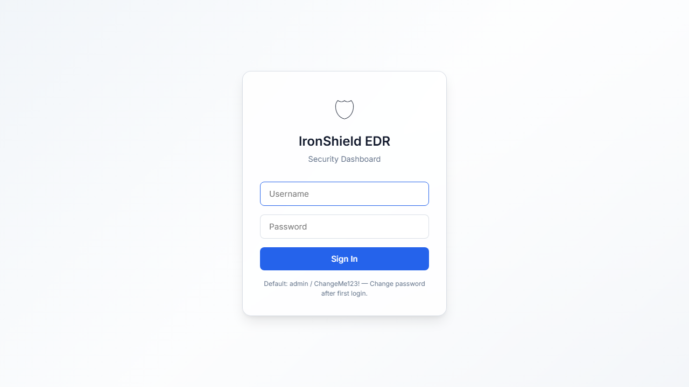
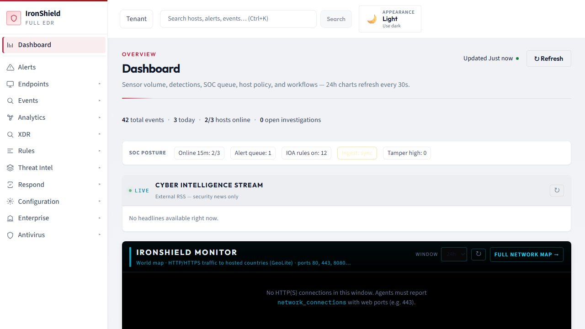
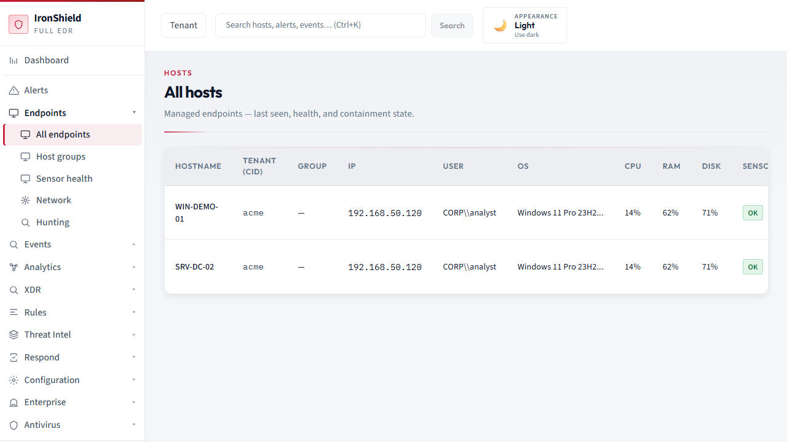
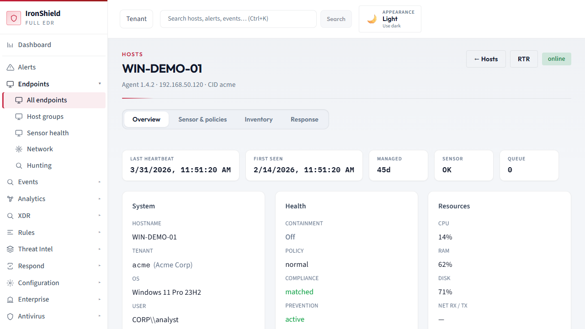
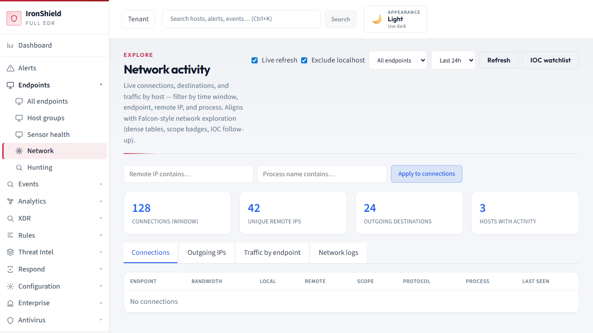
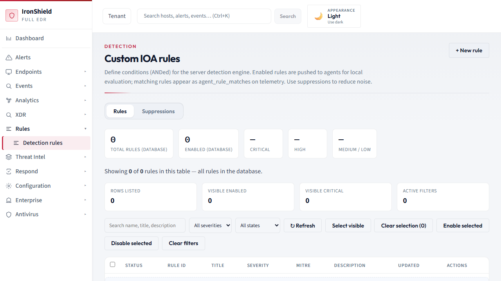
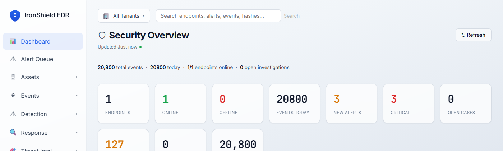
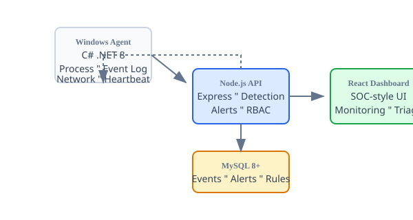

<p align="center">
  
</p>

<p align="center">
  
  
  
  
  
</p>

<p align="center">
  <strong>IronShield Full EDR</strong> — A defensive Windows-focused <strong>full EDR</strong> platform<br>
  (telemetry, prevention, detection, response, investigations) for security monitoring and coordinated response.
</p>

<p align="center">
  Built as an enterprise-ready foundation (hardened defaults, multi-tenant, RBAC, audit integrity).
</p>

<p align="center">
  <a href="#latest-updates">Latest updates</a> •
  <a href="#screenshots">Screenshots</a> •
  <a href="#-features">Features</a> •
  <a href="#-quick-start">Quick Start</a> •
  <a href="#-architecture">Architecture</a> •
  <a href="#-api-overview">API</a> •
  <a href="docs/">Documentation</a> •
  <a href="docs/falcon-parity-features.md">Falcon-class feature map</a> •
  <a href="docs/crowdstrike-ui-phase1.md">Falcon-style UI (Phase 1)</a> •
  <a href="docs/crowdstrike-ui-phase4.md">Sensor telemetry (Phase 4)</a> •
  <a href="docs/crowdstrike-ui-phase5.md">Tenants (Phase 5)</a> •
  <a href="docs/crowdstrike-ui-phase6.md">Sensor updates (Phase 6)</a> •
  <a href="docs/crowdstrike-ui-phase7.md">NGAV / Malware prevention (Phase 7)</a> •
  <a href="docs/crowdstrike-ui-phase8.md">EDR sensor policy (Phase 8)</a> •
  <a href="docs/crowdstrike-ui-phase9.md">Policy compliance (Phase 9)</a> •
  <a href="docs/crowdstrike-ui-phase10.md">Host timeline (Phase 10)</a> •
  <a href="docs/falcon-advanced-ui.md">Falcon-class advanced UI (RTR, graph, analytics)</a> •
  <a href="docs/crowdstrike-detection-rules.md">Detection rules (Custom IOA)</a> •
  <a href="docs/detection-upgrade-plan.md">Detection upgrade plan</a> •
  <a href="docs/crowdstrike-network-activity.md">Network activity (Falcon-style)</a> •
  <a href="docs/enterprise-hardening.md">Enterprise hardening</a> •
  <a href="docs/UPGRADE_AUDIT.md">Enterprise upgrade (Phases 1–9)</a> •
  <a href="docs/ARCHITECTURE.md">Architecture</a> •
  <a href="docs/SECURITY_MODEL.md">Security model</a> •
  <a href="docs/security/README.md">Security assurance (threat model, controls)</a>
</p>

---

## 🆕 Latest updates

| When | What |
|:-----|:-----|
| **May 2026** | **Compact EDR/XDR console** — Eight-page SOC navigation (`/overview`, `/endpoints`, `/detections`, `/investigation`, `/response`, `/hunting`, `/protection`, `/admin`) with tabbed modules, legacy URL redirects, UI modes (Simple / Advanced / Admin), and BFF endpoints `GET /api/v1/console/*`. |
| **May 2026** | **Production hardening (pilot-ready)** — `/api/v1`, agent key hashing, Redis nonces, cert binding, **52** IRN-WIN rules, ESLint in CI, [api.md](docs/api.md) rewrite. See [enterprise-hardening.md](docs/enterprise-hardening.md). |
| **May 2026** | **Enterprise upgrade (Phases 1–9)** — Foundation hardening, formal migrations, agent trust (DPAPI, signed requests, signed response commands), detection-as-code (**31** IRN-WIN rules), SOC triage/MITRE/health UI, integrations & reports, `docker-compose.dev.yml` / `docker-compose.prod.yml`. Full checklist: [UPGRADE_AUDIT.md](docs/UPGRADE_AUDIT.md). |
| **Mar 2026** | **Host detail UX** — `/endpoints/:id` uses a tabbed console layout (**Overview**, **Sensor & policies**, **Inventory**, **Response**): KPI strip, consolidated system/health/resource cards, trimmed operational copy, and removal of the legacy one-click demo remediation block. |
| **Mar 2026** | **README screenshots** — Real UI captures live in [`docs/images/`](docs/images/) (PNG). Regenerate with Playwright after UI changes (see [Screenshots](#screenshots)). |
| **Mar 2026** | **XDR UI + integrations** — XDR pages for `xdr_events` and `xdr_detections`, live **Realtime** feed (`/ws`), host/network bandwidth (RX/TX Mbps), and Enterprise settings for **3rd‑party IP blacklist feeds** → IOC watchlist (`/api/admin/xdr/ip-feeds`). |
| **Mar 2025** | **Network activity (Falcon-style)** — Explore page: KPI strip (`GET /api/admin/network/summary`), time window + endpoint filters, **Exclude localhost**, remote IP / process search, **Scope** badges, tabs (Connections, Outgoing IPs, Traffic by endpoint, Network logs). Docs: [crowdstrike-network-activity.md](docs/crowdstrike-network-activity.md). |
| **Earlier** | Falcon parity phases (sensor telemetry, tenants, NGAV, EDR policy, policy compliance, host timeline), **Detection rules** (Custom IOA), **RTR**, **Threat graph**, **Hunting**, **IOC** watchlist — see [falcon-parity-features.md](docs/falcon-parity-features.md). |

### Enterprise upgrade (Phases 1–9)

Phased upgrade toward production-grade enterprise EDR (defensive only). Baseline audit: [docs/UPGRADE_AUDIT.md](docs/UPGRADE_AUDIT.md).

| Phase | Delivered |
|:------|:----------|
| **1 — Foundation** | Zod env validation, standard API envelope (`success` / `data` / `error` / `requestId`), enterprise permission matrix, `/api/v1` route alias |
| **2 — Data layer** | `npm run migrate` / `migrate:status` / `migrate:rollback` / `seed`, `tenant_id` on events/alerts, `agent_nonces`, tenant isolation tests |
| **3 — Agent trust** | Windows DPAPI for agent keys, single-use enrollment tokens, HMAC request signing + MySQL nonces, **signed response commands** (agent verifies before execute), [mTLS enrollment guide](docs/security/agent-mtls-enrollment.md) |
| **4 — Telemetry** | Canonical event schema (Zod), `event_id` idempotency, queue-first ingest (`INGEST_QUEUE_FIRST`, Redis worker) |
| **5 — Detection** | `server-node/detections/` (**52** IRN-WIN JSON rules), `detections:validate` / `detections:test`, MITRE coverage API + dashboard (`/mitre`) |
| **6 — SOC workflows** | Alert `risk_score` / `evidence_summary` / **why fired**, response lifecycle fields, integration export on new alerts |
| **7 — Dashboard** | Triage queue (`/soc/triage`), host timeline (`/hosts/:id/timeline`), system health, integrations & reports pages, demo banner (`VITE_DEMO_MODE=true`) |
| **8 — Integrations** | Webhook + Splunk HEC providers, report jobs (JSON/HTML) with audit + download |
| **9 — DevSecOps** | [docker-compose.dev.yml](docker-compose.dev.yml) / [docker-compose.prod.yml](docker-compose.prod.yml), [deployment docs](docs/deployment/local.md), [ARCHITECTURE.md](docs/ARCHITECTURE.md), [SECURITY_MODEL.md](docs/SECURITY_MODEL.md) |

---

## 📋 Overview

IronShield is a **full EDR** stack: self-hosted **endpoint visibility**, **NGAV-style prevention**, **rule- and IOC-based detection**, **alerts and investigations**, **remote response (RTR-style)**, optional **XDR-style** correlation (`xdr_events` / `xdr_detections`), and **enterprise controls** (RBAC, multi-tenant, audit). Deploy the **Windows agent** on endpoints, ingest events through the API, and operate from the compact **8-page SOC console** (legacy routes such as `/alerts` redirect to `/detections?tab=alerts`).

**What “full EDR” means here:** prevention + detection + response + case workflows in one product—not only log shipping. OS coverage is **Windows-first** for the agent; other platforms are not the focus of this repository.

| Component | Tech Stack | Description |
|:----------|:-----------|:------------|
| **Windows Agent** | C# .NET 8 | Collects process events, Windows Event Log, network telemetry; sends to backend |
| **Backend API** | Node.js + Express | Event ingestion, detection engine, alerts, RBAC |
| **Database** | MySQL 8+ | Endpoints, events, alerts, rules, investigations |
| **Admin Dashboard** | React | SOC-style UI for monitoring, response, and triage |

---

## 📸 Screenshots

Captured from the **IronShield Full EDR** dashboard (default **mock** mode uses Playwright + stubbed `/api/**` responses so you do not need MySQL or a logged-in stack). **Live** mode records your real data: set `README_CAPTURE_MODE=live`, `README_CAPTURE_USERNAME`, and `README_CAPTURE_PASSWORD`.

**Regenerate PNGs** (Vite dev server must be running on port **5173**):

```bash
cd server-node/dashboard
npm run dev
# other terminal:
npm run capture-screenshots
# optional: README_CAPTURE_URL=http://127.0.0.1:5173
```

Outputs are written to **`docs/images/`** (`login.png`, `dashboard.png`, `banner.png`, `hosts.png`, `host-detail.png`, `network-activity.png`, `detection-rules.png`, `architecture.png` from `assets/architecture.svg`).

| Sign in | Dashboard |
|:---:|:---:|
|  |  |

| All hosts | Host detail (Overview tab) |
|:---:|:---:|
|  |  |

| Network activity | Detection rules |
|:---:|:---:|
|  |  |

<p align="center">
  <sub>Wide banner crop (marketing / hero) · <code>docs/images/banner.png</code></sub><br />
  
</p>

Vector assets (`assets/banner.svg`, `assets/screenshot-*.svg`) remain available for diagrams; **product UI** shots above are raster PNGs.

---

## ✨ Features

### Core Capabilities

- **Endpoint Monitoring** — Process events, Windows Event Log, network connections, file hashing
- **Detection Engine** — DB-backed rules plus **detection-as-code** (`server-node/detections/windows/`, IRN-WIN-* pack) with MITRE ATT&CK mapping
- **Response Actions** — Kill process, triage collection, host isolation (policy)
- **Real Time Response (RTR)** — Remote shell sessions + command queueing, with allowlists and audit trail
- **MSSP Operations** — Per-client overview (endpoints, alerts, investigations) for internal SOC workflows
- **Alert Management** — Severity, status, notes, investigation linking
- **Incident Correlation** — Group related alerts into incidents
- **Risk Scoring** — Endpoint risk based on alert severity and count
- **IOC Watchlist** — Hash, IP, domain, URL indicators (matched during ingestion)
- **Threat intel integrations** — Add **3rd‑party IP blacklist feeds** from Enterprise settings → imports into IOC watchlist
- **Antivirus Module** — File scanning, signatures, heuristics, quarantine
- **XDR foundation** — Canonical multi-source event store (`xdr_events`), detections (`xdr_detections`), live `/ws` stream

### Dashboard Highlights

- **Host detail** — Tabbed host console: overview KPIs, sensor/policy/NGAV strips, inventory (timeline, ports, disk, shares, connections), and response (RTR, queued actions, policy, triage, playbooks); see [screenshots](#screenshots)
- **Network activity** — Falcon-style Explore view: KPIs, filters, scope badges, logs ([docs](docs/crowdstrike-network-activity.md); [screenshots](#screenshots))
- **Bandwidth telemetry** — Agent-reported RX/TX Mbps in host metrics and Network Explore when filtering by endpoint
- **Process Monitor** — Suspect process detection with suspicious path indicators
- **Process Tree** — Visualize process hierarchy from normalized events
- **Investigations** — Case management with notes and endpoint linking
- **Global Search** — Search across endpoints, alerts, events, hashes
- **AV Dashboard** — Detections, quarantine, policies, signatures, file reputation
- **XDR pages** — XDR events, XDR detections, and a Realtime console (WebSocket)
- **SOC triage queue** — `/soc/triage` (open alerts by risk)
- **MITRE coverage** — `/mitre` matrix from DB + code rules
- **System health** — `/system/health` (API, readiness, queue, endpoints)
- **Integrations & reports** — `/integrations`, `/reports` (webhook, Splunk HEC, SOC summaries)
- **Alert “why fired”** — Evidence and risk on alert detail

---

## 🚀 Quick Start

**Recommended (Docker, queue-first):**

```bash
cp .env.example .env   # set JWT_SECRET, MYSQL_*, AGENT_REGISTRATION_TOKEN
docker compose -f docker-compose.dev.yml up --build
docker exec -it edr-backend-dev npm run migrate
docker exec -it edr-backend-dev npm run seed
```

See [docs/deployment/local.md](docs/deployment/local.md) and [docs/deployment/production.md](docs/deployment/production.md).

### 1. Database

```bash
# Using Docker
docker run -d --name edr-mysql \
  -e MYSQL_ROOT_PASSWORD=root \
  -e MYSQL_DATABASE=edr_platform \
  -e MYSQL_USER=edr_user \
  -e MYSQL_PASSWORD=edr_password \
  -p 3306:3306 \
  mysql:8.0

# Apply schema (fresh install) — then use the migration runner for upgrades:
mysql -h 127.0.0.1 -u edr_user -p edr_platform < database/schema.sql
mysql -h 127.0.0.1 -u edr_user -p edr_platform < database/schema-phase3.sql
mysql -h 127.0.0.1 -u edr_user -p edr_platform < database/schema-phase4.sql
mysql -h 127.0.0.1 -u edr_user -p edr_platform < database/schema-phase5.sql
mysql -h 127.0.0.1 -u edr_user -p edr_platform < database/schema-phase6.sql
mysql -h 127.0.0.1 -u edr_user -p edr_platform < database/schema-endpoint-metrics.sql
# Sensor telemetry columns (queue, uptime, containment) — or: cd server-node && npm run migrate-sensor-telemetry
# mysql ... < database/migrate-sensor-telemetry.sql   # prefer npm run migrate-sensor-telemetry (idempotent)

# Phase 5: tenants + endpoints.tenant_id (Falcon-style CID enrollment) — or:
# cd server-node && npm run migrate-phase5-endpoints-tenant
# Sensor update telemetry (pending update on host rows) — or:
# cd server-node && npm run migrate-phase6-agent-update-telemetry
mysql -h 127.0.0.1 -u edr_user -p edr_platform < database/schema-network.sql
mysql -h 127.0.0.1 -u edr_user -p edr_platform < database/schema-antivirus.sql
# NGAV telemetry columns on av_update_status (realtime, prevention, signature_count; after antivirus schema):
# cd server-node && npm run migrate-phase7-ngav-telemetry
# EDR policy id + last sync on endpoints:
# cd server-node && npm run migrate-phase8-edr-policy-sync
# RTR sessions + Falcon UI pack tables:
# cd server-node && npm run migrate-falcon-ui-pack

# Parity phases (DNS/registry/image fields, alert SLA/assignment, response actions, saved views).
# Requires phase5 tenants table if you use tenant_api_limits FK.
# mysql -h 127.0.0.1 -u edr_user -p edr_platform < database/migrate-parity-phases.sql

# Falcon-class host groups (sensor grouping) — or: cd server-node && npm run migrate-cs-parity
# mysql ... < database/migrate-cs-parity.sql   # see script; prefer npm run migrate-cs-parity

# Upgrades from older DBs: rename response action simulate_isolation → isolate_host
# mysql -h 127.0.0.1 -u edr_user -p edr_platform < database/migrate-isolate-host.sql
# Add lift_isolation action type (after isolate_host migration if needed)
# mysql -h 127.0.0.1 -u edr_user -p edr_platform < database/migrate-lift-isolation.sql

# Suppressions, response playbooks (capabilities v2) — from server-node:
# cd server-node && npm run migrate-capabilities-v2
```

Or use **Docker Compose** (full stack):

```bash
docker compose -f docker-compose.dev.yml up -d    # dev: API + MySQL + Redis + worker
docker compose -f docker-compose.prod.yml up -d # prod-oriented env defaults
```

### 2. Backend

```bash
cd server-node
cp .env.example .env
# Edit .env: DB_*, JWT_SECRET, XDR_INGEST_KEY, CORS_ORIGINS
# AGENT_REGISTRATION_TOKEN is break-glass only; prefer per-tenant enrollment tokens.

npm install
npm run migrate          # formal migration runner (replaces ad-hoc migrate-* for upgrades)
npm run migrate:status
ADMIN_PASSWORD="use-a-long-unique-password-here" npm run seed   # or: npm run create-admin
npm start
# Optional: separate terminal for queue worker
npm run worker
```

Optional backend environment (see `server-node` / deployment):

| Variable | Purpose |
|----------|---------|
| `CORRELATION_INTERVAL_MS` | How often to run alert correlation (default `300000` = 5 min). |
| `ENABLE_TENANT_RATE_LIMIT` | Set `true` to cap requests per tenant. |
| `TENANT_RPM` | Requests per minute per tenant when rate limit is enabled (default `600`). |
| `INGEST_QUEUE_FIRST` | When `true` (default in compose), normalize/detect via Redis worker after ingest. |
| `AGENT_REQUEST_SIGNING_REQUIRED` | HMAC agent headers; defaults **on** in production. |
| `AGENT_NONCE_STORE` | `mysql` (default) or `memory` for dev single-node. |
| `REDIS_URL` | Enables BullMQ ingestion worker (`npm run worker`). |

Backend runs on **http://localhost:3001** (terminate TLS at a reverse proxy for enterprise use)

**Validation:**

```bash
cd server-node
npm test
npm run detections:validate
npm run detections:test
npm run audit:verify
npm run lint
cd dashboard && npm run lint
```

### 3. Dashboard

```bash
cd server-node/dashboard
npm install
npm test        # optional — Vitest (UI helpers + pagination)
npm run dev
```

Dashboard runs on **http://localhost:5173** (proxies `/api` to the backend — **use this for UI development**; edits hot-reload).

**If you open the UI through the backend only** (`http://localhost:3001`), the server serves the **pre-built** files in `server-node/public/`. After changing dashboard code, rebuild or you will **not** see updates:

```bash
cd server-node && npm run build-dashboard
# or: cd server-node/dashboard && npm run build
```

Then hard-refresh the browser (**Ctrl+Shift+R**) to bypass cache.

### 4. Windows Agent

**Option A: Installer (recommended)**

```powershell
# Run as Administrator
cd agent-csharp
.\Install-Agent.ps1 -ServerUrl "https://edr.example.com" -RegistrationToken "your-token-from-.env"
```

Or use the batch wrapper:

```cmd
install-agent.cmd https://edr.example.com your-registration-token
```

**Option B: Manual run**

```bash
cd agent-csharp
dotnet build
dotnet run --project src/EDR.Agent.Service -- --console
```

If `dotnet build` fails with **file locked** / `EDR.Agent.Core.dll` in use, stop the running agent (`EDR.Agent.Service`) or Windows service, then rebuild.

Create `config.json` in the agent directory (or copy `config.example.json` and fill in values):

```json
{
  "ServerUrl": "https://edr.example.com",
  "RegistrationToken": "your-token-from-.env",
  "HeartbeatIntervalMinutes": 5,
  "EventBatchIntervalSeconds": 30,
  "ScriptAllowlistPrefixes": ["C:\\IronShield\\Scripts\\"],
  "ScriptAllowlistSha256": []
}
```

`ScriptAllowlistSha256` is optional: when non-empty, `run_script` only executes if the file’s SHA-256 (hex) matches an entry (in addition to path prefix checks). See `docs/agent-service-hardening.md`.

After registration, the agent stores the key via **DPAPI** (`AgentKeyProtected`) instead of plaintext `AgentKey` when supported on Windows.

**Legacy service install:**

```powershell
# Run as Administrator
.\install-service.ps1
Start-Service EDR.Agent
```

**Uninstall:**

```powershell
.\Install-Agent.ps1 -Uninstall
```

---

## 🏗 Architecture

<p align="center">
  
</p>

```
┌─────────────────┐     HTTPS (+ optional mTLS)   ┌─────────────────────────────┐
│  Windows Agent  │ ───────────────────────────►│  Node.js API (Express)      │
│  (C# / DPAPI)   │   signed requests + key     │  /api  +  /api/v1           │
└────────┬────────┘                             └──────────┬──────────────────┘
         │                                                  │
         │  events (event_id dedupe)                        ├──► MySQL
         │                                                  ├──► Redis → worker (normalize + detect)
         │  signed response commands                      └──► React SOC dashboard
         └──────────────────────────────────────────────────────────►
```

**Docs:** [ARCHITECTURE.md](docs/ARCHITECTURE.md) (telemetry pipeline, detection-as-code) · [SECURITY_MODEL.md](docs/SECURITY_MODEL.md) (trust boundaries) · [UPGRADE_AUDIT.md](docs/UPGRADE_AUDIT.md) (phase checklist)

**Roadmap & Falcon-style parity:** See [docs/crowdstrike-parity-roadmap.md](docs/crowdstrike-parity-roadmap.md) for capability analysis beyond the Phases 1–9 upgrade.

---

## 📡 API Overview

### Agent API

| Method | Endpoint | Auth | Description |
|:-------|:---------|:-----|:------------|
| POST | `/api/agent/register` | Registration token | Register new endpoint |
| POST | `/api/agent/heartbeat` | Agent key | Send heartbeat |
| POST | `/api/agent/events/batch` | Agent key | Upload event batch (supports `batch_id` idempotency) |
| POST | `/api/agent/key/rotate` | Agent key | Rotate agent key |
| GET | `/api/agent/actions/pending` | Agent key | Get pending response actions (HMAC-signed when enabled) |
| POST | `/api/agent/actions/:id/result` | Agent key | Submit action result |
| GET | `/api/agent/av/policy` | Agent key | Get AV scan policy |
| GET | `/api/agent/av/signatures/download` | Agent key | Download signatures |
| POST | `/api/agent/av/scan-result` | Agent key | Submit scan results |

### Admin API (JWT)

| Method | Endpoint | Description |
|:-------|:---------|:------------|
| POST | `/api/auth/login` | Admin login |
| GET | `/api/admin/dashboard/summary` | Dashboard stats |
| GET | `/api/admin/endpoints` | List endpoints |
| GET | `/api/admin/alerts` | List alerts |
| GET | `/api/admin/alerts/:id` | Alert detail (includes `why_fired`, `risk_score`) |
| GET | `/api/admin/mitre/coverage` | MITRE ATT&CK coverage matrix |
| GET | `/api/admin/system/health` | API / queue / endpoint health |
| GET/POST | `/api/admin/integrations` | SIEM/webhook integrations |
| GET/POST | `/api/admin/reports` | SOC report jobs (JSON/HTML) |
| POST | `/api/admin/endpoints/:id/actions` | Create response action |
| POST | `/api/admin/endpoints/:id/agent-key/revoke` | Revoke endpoint agent key |
| POST | `/api/admin/endpoints/:id/agent-key/rotate` | Rotate endpoint agent key |
| GET | `/api/admin/process-monitor` | Process monitor data |
| GET | `/api/admin/network/summary` | Network KPIs (connections, unique IPs, hosts, destinations) |
| GET | `/api/admin/network/connections` | Network connections (filters: `hours`, `remoteAddress`, `processName`, …) |
| GET | `/api/admin/av/detections` | AV detections |
| POST | `/api/admin/av/scan-task` | Create scan task |

See [docs/api.md](docs/api.md) for full API reference.

---

## 🛡 Antivirus Module

- **File scanning** — On-demand, scheduled, real-time (FileSystemWatcher)
- **Detection** — Signature (hash, path, binary pattern), heuristics, PE metadata
- **Quarantine** — Move to protected folder, restore/delete workflow
- **Correlation** — Malware alerts → EDR alerts, risk scoring

See [docs/antivirus-setup.md](docs/antivirus-setup.md) and [docs/antivirus-architecture.md](docs/antivirus-architecture.md).

---

## ⚠️ Security Notes

- Provide a strong `JWT_SECRET` (≥32 chars in production) and store secrets in a secrets manager
- Prefer **single-use enrollment tokens**; keep `AGENT_REGISTRATION_TOKEN` for break-glass only
- Deploy behind HTTPS; optional **mTLS** for agents — [agent-mtls-enrollment.md](docs/security/agent-mtls-enrollment.md)
- Enable **agent request signing** in production (`AGENT_REQUEST_SIGNING_REQUIRED`; on by default when `NODE_ENV=production`)
- Agent keys at rest: **DPAPI** (`AgentKeyProtected` in `config.json`) on Windows
- Response commands are **HMAC-signed**; the agent verifies before execution
- Run `npm run audit:verify` or `GET /api/admin/audit-logs/verify` for audit hash-chain checks
- Agent runs as LocalSystem by default; consider a dedicated service account

See [docs/SECURITY_MODEL.md](docs/SECURITY_MODEL.md) and [docs/enterprise-hardening.md](docs/enterprise-hardening.md).

---

## 📄 License

MIT License

---

## 👤 Developer

**Coder-X**

[](https://github.com/Coder-MoeTain)

---

<p align="center">
  <sub>Built with ❤️ for the security community</sub>
</p>
